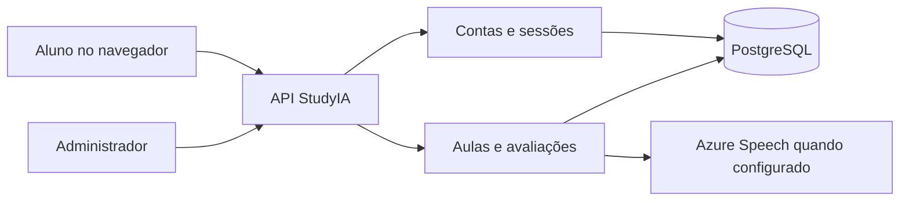

# Uma empresa, PostgreSQL e operação confiável

## Implementado nesta etapa

O servidor usa node-postgres e PostgreSQL, sem substituição por SQLite ou banco em memória para contas. O modo sem DATABASE_URL é uma demonstração local explicitamente separada. Erros do banco retornam erro; não aprovam uma aula ou prova localmente em nome da conta.

Módulos: backend/database.mjs (conexões e transações), migrations (esquema), accounts.mjs (identidade local), learning.mjs (progressão) e api.mjs (HTTP). O currículo atual continua compartilhado pelo servidor e interface. Não é necessário dividir a primeira empresa em vários serviços.

Tabelas relacionais: company, users, sessions, invitations, learner_state, lesson_progress, exam_attempts, exam_answers e schema_migrations. Foreign keys, unicidade, checks, triggers e transações protegem o vínculo entre dados e a consistência das notas. Uma prova concluída exige dez respostas e nota igual à média; alterar respostas de uma prova concluída para uma média inconsistente também falha.

A empresa é única (primary). A primeira configuração cria seu administrador; novas contas de aluno exigem convite de uso único, válido por 72 horas. O administrador vê o relatório da empresa. Alunos só leem e alteram sua própria jornada. Senhas usam scrypt com salt aleatório; cookies de sessão são HttpOnly/SameSite e expiram em 12 horas. Requisições autenticadas de escrita exigem token CSRF. Não há envio automático de convites, recuperação de senha por email nem login Entra ativo nesta versão.

Cada alteração da aprendizagem usa transação e advisory lock por usuário, na mesma conexão do pool. Respostas são corrigidas no servidor. O áudio é avaliado fora da transação; ao retornar, só é registrado se a tentativa e questão continuarem atuais. Progresso e notas da conta nunca são importados diretamente do backup local. Atividades rápidas antigas, preferências e histórico da conversa ainda são locais e não fazem parte do curso corporativo sincronizado.

## Conectar um banco

1. Instale Node 24 ou superior e execute npm ci --ignore-scripts.
2. Crie um banco PostgreSQL e dois usuários de operação: um para migrações e outro para a aplicação, com privilégios mínimos. Em desenvolvimento pode usar um único usuário no banco de teste.
3. Configure DATABASE_URL no .env local. Para host externo, configure DATABASE_TLS=require e, se necessário, DATABASE_CA_FILE. A validação do certificado não é desativada. Não use parâmetros SSL dentro de DATABASE_URL; a configuração TLS fica nessas variáveis.
4. Execute npm run migrate com a credencial de migração. O comando mantém checksum e serializa a aplicação do esquema. Não edite migrações já aplicadas; futuras alterações exigem novas migrações e ampliação do runner.
5. Inicie npm start com a credencial da aplicação. Abra Conta e empresa para configurar o administrador. O servidor atual só aceita localhost; a primeira configuração deve acontecer nesse ambiente controlado.

O provedor e o banco de produção ainda não foram provisionados. Não existem credenciais de exemplo funcionais ou senhas padrão de administrador. A senha do workflow é exclusivamente para um PostgreSQL descartável de CI.

## Disponibilidade e integridade

Nenhum banco ou provedor garante disponibilidade absoluta de 100%. Integridade transacional, redundância, recuperação e disponibilidade são objetivos distintos. PostgreSQL é a base escolhida; alta disponibilidade depende da infraestrutura e dos procedimentos de operação.

Para produção, a arquitetura proposta é PostgreSQL gerenciado com primário e standby em zonas distintas, failover gerenciado, armazenamento durável, TLS verificado, backups automáticos, arquivamento WAL/PITR e monitoramento. Replicação síncrona pode proteger transações confirmadas nas falhas previstas pela configuração; isso não elimina falhas de aplicação, perda simultânea de réplicas ou indisponibilidade durante uma troca de primário. Replicação não substitui backup.

Antes de contratar e publicar, definir uma meta mensurável de disponibilidade, RPO (perda máxima de dados) e RTO (tempo máximo para recuperar). Um alvo inicial para discussão é disponibilidade mensal de 99,95%, RPO zero para transações confirmadas sob perda de uma zona com replicação síncrona e RTO de até cinco minutos para esse cenário. Esses números são metas propostas, não garantias implementadas, e precisam ser verificados no plano contratado e nos testes de falha. Falha regional e restauração de backup precisam de metas próprias.

Plano de operação:

- Manter backups criptografados fora do banco principal e retenção definida; habilitar PITR conforme o provedor.
- Monitorar prontidão, latência, conexões, espaço, erros, replicação e sucesso dos backups.
- Restaurar periodicamente em um banco isolado e comparar usuários, etapas, respostas e notas. Nunca ensaiar uma restauração sobre o primário de produção.
- Ensaiar failover e medir RTO/perda, inclusive uma conexão interrompida depois de COMMIT. Consultar o estado após resultado incerto, sem inventar sucesso nem reenviar indiscriminadamente operações.
- Fazer migrações compatíveis com versões da aplicação e validar restauração antes de mudanças destrutivas.
- Ter redundância da aplicação também; um único processo Node no computador não oferece alta disponibilidade mesmo com banco redundante.

GET /health/live verifica o processo. GET /health/ready verifica acesso ao banco e presença do esquema; retorna 503 sem PostgreSQL funcional. Os endpoints não revelam credenciais. Não há alertas, failover ou backups de produção ativados por esses endpoints.

## Validação e publicação

Os testes locais usam PGlite, motor PostgreSQL embarcado apenas para testes, para executar o SQL, as restrições, as transações e as rotas. O teste de exportação/reabertura desse motor não comprova PITR ou failover de um cluster. O workflow usa também PostgreSQL 18 em serviço separado, pelo driver pg; cada teste recebe um schema isolado. Esse workflow precisa concluir na plataforma antes de afirmar que a validação remota passou.

Ainda são necessários: contratar/conectar a infraestrutura; testes reais de carga, TLS e recuperação; HTTPS e cookies Secure ao adaptar o servidor para hospedagem; gateway com limites distribuídos; recuperação de conta e revisão de segurança; implantação e observabilidade. A estrutura Entra/OIDC anterior continua preparada, sem autenticação federada ativa.

Referências oficiais: [transações no node-postgres](https://node-postgres.com/features/transactions), [alta disponibilidade PostgreSQL](https://www.postgresql.org/docs/current/high-availability.html), [replicação síncrona](https://www.postgresql.org/docs/current/warm-standby.html#SYNCHRONOUS-REPLICATION) e [PITR](https://www.postgresql.org/docs/current/continuous-archiving.html).
